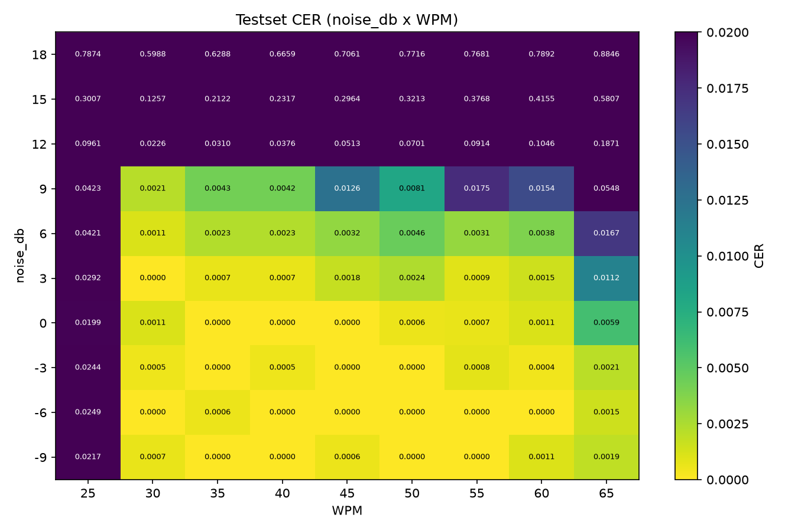
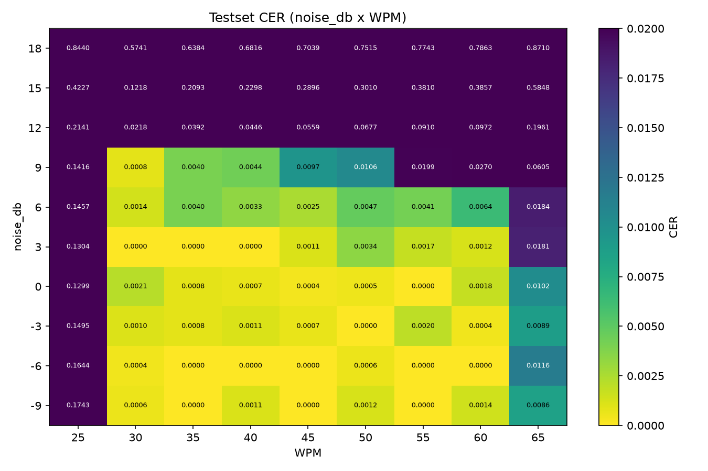

# CWDL

用于识别CW Morse通讯的深度学习系统

## 目录结构和文件

checkpoints - 权重
dataset - 数据集合成数据源
cnntriset - 用于训练CNN+RNN以识别特征的三个集合（训练，验证，测试）
experiment - 一些想法和实验

cnnset.py - 用来生成v1 v2数据集的脚本
cnnsetv3.py - 用来生成v3数据集的脚本
spectrogram.py genmorese.py - 数据集生成辅助类
train* model* - 模型和训练脚本
eval_heatmap.py - 生成热力图

## 数据集和预处理

oxford5000：牛津常见5000词，剔除了长度小于3个字母的词汇
radioabbr：常见CW通讯缩写
random6：10000个3-6位随机长度的随机字母数字
random50：10000个30-50位随机长度的随机字母数字空格

随后这些数据被合成为30WPM到60WPM的CW音频，其中：
- 加入随机最大值在10Hz-100Hz的频率偏倚，FM调制函数是在0.2-1Hz的三角波
- 加入每个点划的WPM偏倚，范围为正负20%
- 叠加指定的附加噪声功率后归一化
- 经过200Hz带宽60dB/dec的成型滤波器
- 采样率统一为48000Hz，前20ms和后20ms是保护间隔。

随后进行STFT,抽取为375Hz高度的灰度频谱图，其中每23.4375Hz定义为一个像素高（这是为了fft长度为2048），即高度为16px，每10ms定义为一个像素长。这些带保护边缘的wav会生成以128px为单位的，带保护间隔的音频和频谱图，随后按50%重叠率分块，其中被切断的电码会被替换为-以便于CTC训练。

训练集是以附加噪声功率和WPM分类的，附加噪声功率的范围是+18dB到-9dB，3dB每步。WPM有30,40,50,60四种，以此组合，每组合随机抽取3000个序列，共计120000条。每3000条中500条是在oxford5000和radioabbr中随机抽取的，剩下2500条是在random6中抽取的（这是为了避免在学习过程中学习到自然语言结构），SWM*WPM组合内抽取结果不重复。

验证集和测试集也是按上方标准抽取的，附加噪声功率的规律不变，WPM为25 30 35 40 45 50 55 60 65，以此组合，每组合随机抽取300个序列，三个集合词汇间互斥，词汇池比例为6/2/2。

每个词组具有不定长度的后黑，这是刻意保留而未填充为白噪声的，意图使得模型学会处理实时输入和可能的后黑。

## 架构和训练日志
分为两个神经网络，第一个CNN通过提取音频的频谱图得到特征向量，第二个BiGRU通过提取前后特征最终给出解码结论，两个网络是协同训练的，在训练中，CNN接受预切割好的窗口，每个上下文训练滑动整个词汇的一个区块，整个序列不去重的送入BiGRU，去重由CTC实现。

CNN网络首先通过卷积层快速将高度压缩到1px，意图使网络快速学会忽略和压缩频偏，然后做1D CNN提取点划空特征，随后提取到的这些特征送入BiGRU，接入CTC后进行学习。

v1 结构 (0.17M)：
- 3x3 conv2d stride4x1 padding0x1 Norm ReLU 16ch
- 3x3 conv2d stride4x1 padding0x1 Norm ReLU 32ch
至此，模型已经完全和压缩频偏（高度为1），随后：
- 3x1 conv1d dilation1 padding1 Norm ReLU 32->64ch (感受野3步)
- 3x1 conv1d dilation2 padding2 Norm ReLU 64ch (总感受野7步)
- 3x1 conv1d dilation4 padding4 Norm ReLU 64ch (总感受野15步)
- BiGRU layer2 input64 hidden64 drop0.3
最终贪心以后得到结果，损失直接使用标准CTCLoss。
第一次最佳 epoch=27, cer=0.1137 手动降低学习率，随后
第二次最佳 epoch=30, cer=0.1110 改进学习率下降函数 降低学习率
第二次最佳 epoch=43, cer=0.1097 

v1.1(参数加大加宽版 0.7M) 结构：
- 3x3 conv2d stride4x1 padding0x1 Norm ReLU 32ch
- 3x3 conv2d stride4x1 padding0x1 Norm ReLU 64ch
至此，模型已经完全和压缩频偏（高度为1），随后：
- 3x1 conv1d dilation1 padding1 Norm ReLU 64->128ch (感受野3步)
- 3x1 conv1d dilation2 padding2 Norm ReLU 128ch (总感受野7步)
- 3x1 conv1d dilation4 padding4 Norm ReLU 128ch (总感受野15步)
- 3x1 conv1d dilation8 padding8 Norm ReLU 128ch (总感受野30步)
- BiGRU layer2 input128 hidden128 drop0.3
最终贪心以后得到结果，损失直接使用标准CTCLoss。
第一次最佳 epoch=7, cer=0.1172 手动降低学习率，随后
第二次最佳 epoch=33, cer=0.1092

纵然CER仍相对较高，但是我认为这是测试集中存在较低SNR和较极端WPM的样本，
尤其的，有较低WPM的样本，模型感受野可能不足以识别整个点划。 顺便一提
在这个任务上，LSTM没有比GRU表现的更佳，但是慢许多，所以选用GRU

v2 (~~变形金刚~~版 1.92M) 结构：
- 3x3 conv2d stride4x1 padding0x1 Norm ReLU 64ch
- 3x3 conv2d stride4x1 padding0x1 Norm ReLU 128ch
此处完全移除了1D卷积层，意图使Transfomer模型直接理解1D莫尔斯序列
- EncoderOnlyTransfomer dmodel128 dffn512 nhead4 layer4 drop0.3
最终贪心以后得到结果，损失直接使用标准CTCLoss。效果十分不好（）

v3 (0.79M)结构：
- 3x3 conv2d stride4x1 padding0x1 Norm ReLU 16ch
- 3x3 conv2d stride4x1 padding0x1 Norm ReLU 32ch
- 3x1 conv1d dilation1 padding1 Norm ReLU 64ch
- 3x1 conv1d dilation2 padding2 Norm ReLU 64ch
- 3x1 conv1d dilation4 padding4 Norm ReLU 64ch
- BiGRU layer3 input64 hidden128 drop0.3
该神经网络只用 random50 进行训练,加入了DataParallel。
- 附加噪声功率的范围改变到+18dB到-15dB，3dB每步 （验证集只执行+10到-10dB）
- 验证集和测试集WPM范围改为10 25 30 35 40 45 50 55 60 65 80 （验证集只执行25到65）
- 加入每个点划的WPM偏倚，范围为正负20%
- 添加了新的QSB和QRN干扰 算法摘自WC9F的cwsim，有85%的样本加入了QRN，有20%的样本加入了（10% 12dB 20% 9dB 70% 6dB）的QSB。
- 添加白噪声随机的CW载波带宽变化正负20%
- 删去原本的白噪声 QRN
- 50%的样本添加了随机的0.1-0.25单位的多径延迟，随机抽取3-5个多径
这总共产生了约6.6G+2.2G+2.2G的数据集 发现val集有4w条数据，非常大，按1：5均匀抽取后，最终结果就是6：0.4 = 15：1

（阅读实现，发现LLM的val集一直是从test集中抽0.5%抽出来的，所以一定要盯着LLM写实现）
最终结果： epoch=3  cer=0.044039199433132344
分析特征图发现似乎卷积通道和1dCNN并没有提取出很好的特征，感觉过大是没必要的？

v4 (2.02M) 结构：
- 3x3 conv2d stride4x1 padding0x1 Norm GELU 32ch
- 3x3 conv2d stride4x1 padding0x1 Norm GELU 64ch
- 3x1 conv1d dilation1 padding1 Norm GELU 128ch
- 3x1 conv1d dilation2 padding2 Norm GELU 128ch
- 3x1 conv1d dilation4 padding4 Norm GELU 128ch
- Transfomer d_model128 dimff512 nhead8 encode4 decode4 drop0.15
再试试变形金刚,GELU
- 添加了<bos>和<eos>token，添加了<unk>token
阅读了代码 添加了便于读者理解的辅助注释
结果不收敛 依然非常不好

v5 (4.02M)结构
- 3x3 conv2d stride4x1 padding0x1 Norm ReLU 32ch
- 3x3 conv2d stride4x1 padding0x1 Norm ReLU 32ch
- 3x1 conv1d dilation1 padding1 Norm ReLU 64ch
- 3x1 conv1d dilation2 padding2 Norm ReLU 64ch
- 3x1 conv1d dilation4 padding4 Norm ReLU 128ch
- BiLSTM layer3 input128 hidden256 drop0.3
该神经网络用 random50 和 realcomm 进行训练， 添加了特殊的token [DEL]，在序列化的时候产生4-8个dot,dot间间隔有可能是1dot 有可能是2dot 但是这几个之间间隔是完全一样的 添加了特殊的token [SK] 在序列化的时候是	···-·- 添加了特殊的token [BK]  在序列化的时候是-···-·- 
CNN层从v3best中net2net到v5作为起始权重
考虑到超长的序列需求，这里换用了LSTM
考虑到超长的序列需求，重定义了损失函数，只要输出一个space, 则gt无论有多少连续space都是0损失的
